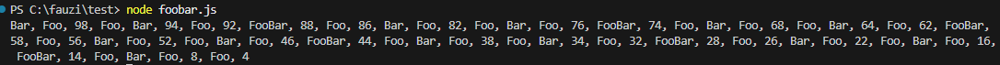
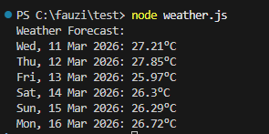

# Foobar & Weather Utilities

Two simple Node.js scripts demonstrating basic programming logic and external API consumption.

## Files

| File | Description |
|------|-------------|
| `foobar.js` | Generates a number sequence (100→1) with FizzBuzz-style substitutions, skipping primes |
| `weather.js` | Fetches a 5-day weather forecast from OpenWeatherMap for Jakarta, Indonesia |

## Features

### `foobar.js`

- Iterates backwards from 100 to 1
- Skips prime numbers
- Prints `FooBar` if divisible by both 3 and 5
- Prints `Foo` if divisible only by 3
- Prints `Bar` if divisible only by 5
- Prints the number itself if even

### `weather.js`

- Calls the OpenWeatherMap 5-day forecast API
- Displays up to six distinct calendar days with temperatures in °C
- Includes basic error handling for HTTP failures

## Usage

```bash
node foobar.js
node weather.js
```

> **Note:** `weather.js` requires an internet connection to reach the OpenWeatherMap API.

## Results

**foobar.js**



**weather.js**



## Notes

- The API key is hard-coded for demo purposes — store it securely in production.
- Both scripts are intentionally simple and suitable for educational use.